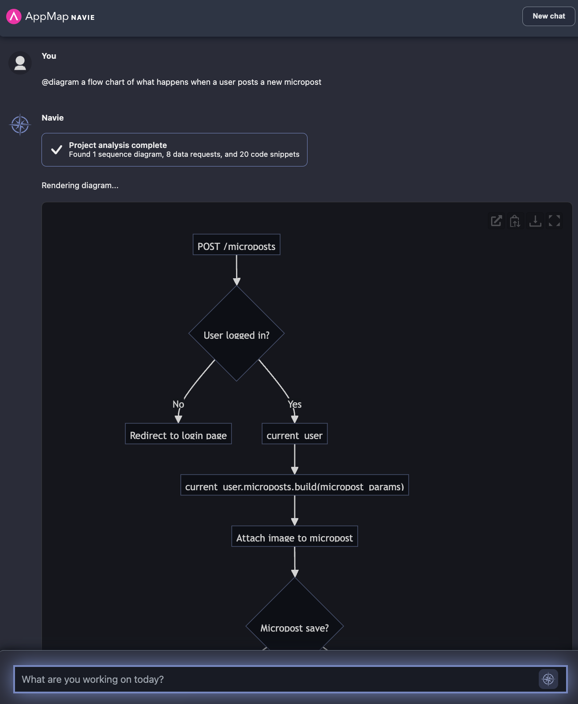

# How to use this repo

This project is a fork of the [Rails Tutorial 7th Edition](https://github.com/learnenough/rails_tutorial_sample_app_7th_ed) project. You can view the original [README here](OLD_README.md). 
This an ideal Ruby project to use with the [AppMap Navie](https://appmap.io/navie/) AI Architect.

You can use this project to ask various questions of AppMap Navie using the `@diagram` command prefix.  
This will generate Mermaid diagrams that you can use within GitHub Issues & Pull Requests, or otherwise share 
with members of your team. 


## Example Diagrams
- [Sequence Diagram](#sequence-diagram)
- [Entity Relationship](#entity-relationship)
- [Flow Chart](#flow-chart)
- [Class Map](#class-map)

### Sequence Diagram

```
@diagram the steps that happen when a user logs into my service.
```


### Entity Relationship

```
@diagram the entitiy relationships between the major parts of my data such as users, followers, following, and microposts.
```


### Flow Chart

```
@diagram a flow chart of what happens when a user posts a new micropost
```




### Class Map
```
@diagram a class map of the users, followers, and microposts
```


